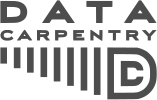
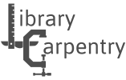
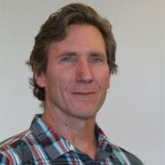

# Committee Meeting

## 2020-08-06

### Introduction

{height=100px}

- MPH in Epidemiology, Columbia University, 2014
    - Thesis: Agent-based models
        - Computational psychology: spread of ideas in a social network
    - Took my first data science class
        - Rachel Schutt, Kayur Patel, Jared Lander
        - Software-Carpentry workshop attendee
    - Adviser: Mark Orr, Columbia--> Virginia Tech (SDAL)

{height=100px}

- PhD Student in Genetics, Bioinformatics, and Computational Biology (GBCB)
    - https://gbcb.graduateschool.vt.edu/
    - Matriculated Spring 2015
    - One of the Interdisciplinary Graduate Education Program (IGEP) by Dean Karen DePauw
    - Program Director: Liwu Li, Biological Sciences
    - Admissions Committee Chair: T. M. Murali, Computer Science & Applications
    - Program Liaison: Dennie Munson, Interdisciplinary Graduate Programs
        - She's the best, if you need anything she can make it happen.

- Dissertation disruption
    - Mark -> NDSSL; Dan student -> Faculty/Staff
        - Worked as a data engineer
            - On many projects, but none were dissertation specific
            - Something to do with health care
        - Most promising project: "Smart Scatter"
            - Worked with Dave Higdon and Ian Crandall
    - Data Science for the Public Good (SDAL)
        - https://bi-sdal.github.io/training/
        - https://chendaniely.github.io/training_ds_r/
    - Biocomplexity Institute VT -> UVA

{height=100px}
{height=100px}
{height=100px}
{height=100px}

- Software-Carpentry
    - Non-profit organization aimed to teach researchers the programming skills they need for research
    - Co-founded by Greg Wilson
    - Joined 2014
    - Active instructor until 2017
    - All my technical teaching experience was from the workshops I taught
    - Software-Carpentry + Data Carpentry + Library Carpentry = The Carpentries

{height=100px}

- Building off the Carpentries
    - Authored "Pandas for Everyone"
    - Pearson liveLessons
        - Python and Git
    - DataCamp classes (but we don't talk about those)
        - tl;dr: https://twitter.com/johncassil/status/1278685420595920897

{height=100px}

- RStudio Intern Summer 2019
    - RStudio Education team
    - Worked on the {gradethis} package
    - Code grader that can return formative error messages
    - Made to be used with {learnr} interactive documents to create interactive lessons
    - Gave a talk for Max Khun at the Non-clinical Biostatistics Conference (NCB)
    - Got to TA Allison Hill's {knitr} workshop at R/Medicine
        - Met Peter Higgins (UMish) and Stephan Kadauke (CHOP)

- What am I good at and interested in
    - Teaching technical computing
    - Healthcare/medicine
    - Andi Ogier, Director Data Services -> Anne Brown
    - Anne Brown is a recent GBCB faculty member

#### Anne Brown

- Brown Experential Learning

{height=100px}

- Bevan Brown Lab: https://bevanbrownlab.com/

{height=100px}
{height=100px}
{height=100px}
{height=100px}

- DataBridge: https://www.databridge.dev/

- Officially part of the Library
- Affiliate in Biochemistry 
- Academy of Integrated Sciences
    - https://www.ais.science.vt.edu/
    - Majors: Computational Modeling and Data Analytics (CMDA), Nanoscience, and Systems Biology
    - Minors: Data and Decisions, Integrated Science Curriculum, Science, Technology, & Law

- David Bevan was her mentor and created the GBCB program
- Expertise in conceptualizing pedagogical studies
- Invested in Data Education

- VT Libraries
    - Commitment with/to the Carpentries
    - Open@VT (https://blogs.lt.vt.edu/openvt/)

### Deliverables

{height=100px}
{height=100px}

1. Identify and create learner personas for the biomedical community
2. Create a set of CC-0 lessons for the biomedical community
    - Carpentries-inspired
    - Carpenties Incubator: Data Science for Practicing Clinicians
        - https://carpentries-incubator.github.io/Data-Science-for-Docs/
        - Too much emphasis on Medical Doctors

### Phases + research questions

- IRB 20-537: Data Science Workshops for Biomedical and Health Professionals: Persona Identification and Workshop Assessment

1. Pre-workshop student self assessment survey to create learner personas
    - https://github.com/chendaniely/dissertation-irb/blob/master/irb-20-537-data_science_workshops/survey-01-pre_workshop_self_assessment.pdf
2. Pre/post workshop survey to assess the workshop materials
3. Long-term workshop survey (6 months out) to see if the materials helped with fundamental knowledge to learn more on their own

#### Research questions

3 main questions:

1. Does the biomedical community have different types of learners? How will their needs differ in the creation of learning and training materials?
    - Phase 1 questionnaire will go through validity and respondent clustering to identify personas
2. Does having interactive feedback with informative error messages in formative and summative assessment questions improve the learner's ability to learn and keep learning?
    - Using tools like {learnr} with the {gradethis} and {pygradethis} library to create training materials.
    - Pre/post workshop surveys can confirm existing knowledge along with results from the interactive questions in the workshop.
3. Does tailored workshop materials help learners retain knowledge, use the tools, and continue self-learning?
    - Combining all the surveys to determine "efficacy"
    
In more detail:

1. Creating learner personas will create better educational content because they will be more tailored to the needs of the students.
2. Learning how to program data analysis will allow learners to feel like they can do more with their data.
3. Learning basic data literacy and data science skills can empower health/biomed workers and be more proactive in making more educated decisions.
4. Workshops with an eye towards tidy data principles will better transition students out of a spreadsheet program into programming.
5. Workshops will help medical professionals curate better data for research.
6. Workshops will help medical professionals work with data outside of a spreadsheet program.

#### What is "effective"?

Learning objectives:

1. Name the features of a tidy/clean dataset
2. Transform data for analysis
3. Identify when spreadsheets are useful
4. Assess when a task should not be done in a spreadsheet software
5. Break down data processing into smaller individual (and more manageable) steps
6. Construct a plot and table for exploratory data analysis
7. Build a data processing pipeline that can be used in multiple programs
8. Calculate, interpret, and communicate an appropriate statistical analysis of the data

#### Samples

Snowball sample from relavant listservs on campus

1. Dennie Munson -- igep
2. Taryn Luoma (taryn1@vtc.vt.edu) -- fbri + iThriv
3. Nathaniel Porter (ndporter@vt.edu) -- swc tmbh students (n=3?)
4. Andrea Green (greena15@exchange.vt.edu) vetmed
5. Hannah Menefee (hmenefee@vt.edu) -- mph

### Preliminary results

#### 1-way statistics

**TODO INSERT FIGURES**

1. **A LOT** of Excel
    - Very basic usage
    - Do not use other specialized software for tasks, mainly just Excel
2. No knowledge of "tidy data"
    - Fundamental to processing and cleaning data

#### Personas

- Dendogram shows 3 or 5 groups
- Groups in sequential order is suspicious
    - Seems to be from when the surveys were sent out to the listservs

#### Creating Personas

- Through the Eyes of Faculty: Using Personas as a Tool for Learner-Centered Professional Development
    - https://www.lifescied.org/doi/10.1187/cbe.19-06-0114
    
- methods that combine hierarchical agglomerative cluster analysis with chi-square values or squared Euclidian distance values and complete or average linkage

- RStudio learner Personas
    - https://rstudio-education.github.io/learner-personas/
    

### Paper topics

1. Learner Personas
2. Feedback with informative error messages during a workshop
3. Overall assessment of the workshop for "effectiveness"

### Committee

Currently:

{height=100px}
1. Anne Brown - Library

{height=100px}
2. Alex Hanlan - Biostatistics

Need to re-confirm:

{height=100px}
3. Dave Higdon - Statistics

Other people:

{height=100px}
1. Dennis Kafura - Computer Science - Computer science education

{height=100px}
2. Margaret Ellis - Computer Science - Digital education

{height=100px}
3. Jane Robertson Evia - Statistics - Statistics education

{height=100px}
4. Nikki Lewis - Honors College

{height=100px}
5. Amy Nelson - History - Pedagogical Practices in Contemporary Contexts
    - Future Professoriate Certificate

### Overall impact

- "Integrating scientific programming in communities of practice for students in life science"
    - https://dl.acm.org/doi/10.1145/3332186.3333040
    - People in the life sciences are afraid to take courses in CS and Stats

- Help augment the training from Center for Biostatistics and Health Data Science (CBHDS)
    - https://biostat.centers.vt.edu/
- Goal is not to teach statistics but the data literacy side of data science
    - Managing and "cleaning" data
    - Be able to better communicate with analysts and statisticians
- Carpentries-inspired training materials to help scale
    - Have a CC-BY set of training materials that can be remixed by others
    - VT has a core group of Carpentries certified instructors
        - Anne is just about finishing up her checkout
- Build a community of practice
    - "Building a local community of practice in scientific programming for life scientists"
        - https://journals.plos.org/plosbiology/article?id=10.1371/journal.pbio.2005561
    - "If you build it, they will come...but then what? Facilitating communities of practice in R"
        - https://rstudio.com/resources/rstudioconf-2020/if-you-build-it-they-will-come-but-then-what-facilitating-communities-of-practice-in-r/
